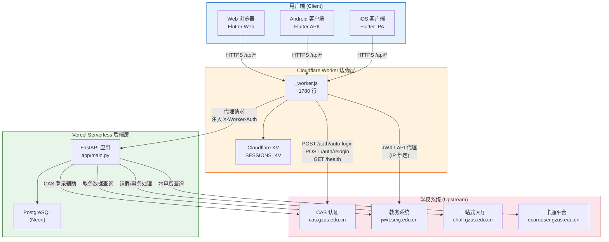

# 第1章 系统概述与架构设计

> 软帮手（OneGZUS）软件设计文档  
> 版本：1.0 | 最后更新：2026-06-17

---

## 1.1 项目背景与目标

### 1.1.1 项目定位

软帮手（OneGZUS）是面向广州软件学院（Guangzhou University of Software，GZUS）在校学生的教务事务助手应用。项目名称"OneGZUS"寓意"一站式广州软院服务"，旨在将分散于多个学校系统（教务管理系统 JWXT、一站式服务大厅 ehall、一卡通平台 ecard、统一身份认证 CAS）中的常用功能整合到统一的移动端入口，为学生提供便捷、高效的教务事务处理体验。

广州软件学院的教务事务涉及多个独立系统，学生日常需要频繁在教务管理系统（JWXT）查看课表与成绩、在一站式服务大厅（ehall）提交请假申请、在一卡通平台查询水电费余额。这些系统界面风格各异、操作流程繁琐，且缺乏移动端适配，给学生使用带来不便。软帮手通过统一的移动端界面，将这些分散的功能聚合为流畅的一站式体验。

### 1.1.2 核心功能

软帮手围绕学生日常教务事务需求，提供以下六大核心功能模块：

| 功能模块 | 数据来源 | 功能描述 |
|----------|----------|----------|
| **课表查询** | JWXT 教务系统 | 按学期查看个人课程表，支持周视图和日视图，支持导出 iCal 日历文件 |
| **成绩查询** | JWXT 教务系统 | 按学期查看各科成绩与绩点，支持成绩变动推送通知 |
| **考勤统计** | JWXT 教务系统 | 查看各课程考勤明细与缺勤统计 |
| **水电费查询** | 一卡通平台（ecard） | 绑定宿舍房间后查看电费、冷水费、热水费余额，支持低余额自动提醒 |
| **在线请假** | ehall 一站式服务大厅 | 在线填写请假申请、上传附件、查看审批进度，支持请假天数自动计算 |
| **考试提醒** | JWXT 教务系统 | 查看考试安排，支持考试时间推送通知与 WebSocket 实时消息 |

此外，系统还提供以下辅助功能：

- **教务通知**：聚合 JWXT 教务通知，支持新通知推送
- **天气查询**：基于 wttr.in 的天气数据代理接口
- **WebSocket 实时通知**：通过长连接实现消息即时推送
- **版本更新**：检查应用更新并引导下载安装

### 1.1.3 目标用户

软帮手的目标用户群体为**广州软件学院在校本科生**。该用户群体具有以下特征：

- 需要频繁与教务系统交互（选课、查成绩、请假等）
- 移动端使用习惯为主，对 Web 端教务系统操作体验不满
- 对响应速度和操作便捷性有较高期望
- 网络环境以校园 Wi-Fi 和移动数据为主

系统设计以"零学习成本"为原则，确保学生无需培训即可上手使用。

### 1.1.4 项目目标

| 目标维度 | 具体目标 |
|----------|----------|
| **体验目标** | 将多系统操作流程整合为单一入口，核心操作 3 步内完成 |
| **性能目标** | 登录响应 < 5 秒（含 CAS 认证），数据查询响应 < 2 秒 |
| **可用性目标** | 服务可用率 > 99%，支持 Serverless 冷启动自动恢复 |
| **成本目标** | 全栈零成本部署（Cloudflare Pages/Workers 免费额度 + Vercel 免费额度 + Neon 免费额度） |
| **安全目标** | 用户凭证加密存储，会话 IP 绑定防护，请求速率限制 |

---

## 1.2 系统整体架构

### 1.2.1 架构概述

软帮手采用**三层边缘代理架构**，在传统的前后端分离架构基础上，引入 Cloudflare Worker 作为边缘计算层，解决学校 CAS SSO 登录的 IP 绑定约束与中国大陆网络延迟问题。

三层架构自上而下为：

1. **Flutter 前端层**：运行于用户浏览器或移动设备，负责 UI 渲染与用户交互
2. **Cloudflare Worker 边缘层**：运行于 Cloudflare 全球边缘节点，负责 CAS SSO 登录、会话管理、请求代理
3. **FastAPI 后端层**：运行于 Vercel Serverless，负责业务逻辑处理、数据持久化、后台任务

### 1.2.2 架构图



### 1.2.3 请求流转概述

系统的请求流转遵循以下核心路径：

#### 路径一：CAS SSO 登录流程（边缘处理）

```
用户 → Flutter 前端 → Cloudflare Worker → CAS 服务器
                                      ↓
                              Worker 边缘完成登录
                                      ↓
                              Worker → Vercel /internal/create-session
                                      ↓
                              Vercel 创建会话 → PostgreSQL
                                      ↓
                              Worker 返回 sessionId → 前端
```

1. 用户在 Flutter 前端输入学号与密码
2. 前端将加密后的凭证发送至 Cloudflare Worker 的 `/auth/auto-login` 端点
3. Worker 在边缘节点执行完整的 CAS SSO 登录流程：
   - 获取 CAS 登录页面，下载验证码图片
   - 调用 Vercel 后端 `/internal/ocr` 进行验证码 OCR 识别
   - 使用 RSA 加密密码，提交登录请求
   - 获取 CAS Ticket，跟进重定向获取 JWXT/ehall 会话 Cookie
4. Worker 将登录结果（Cookie、学号等）通过 `/internal/create-session` 发送至 Vercel 后端
5. Vercel 后端创建 `AppSession` 记录，存入 PostgreSQL，返回 `sessionId`
6. Worker 将 `sessionId` 返回给前端，同时在 KV 中缓存会话 Cookie

> **设计要点**：CAS 登录必须在 Worker 边缘节点执行，因为学校系统会将会话 Cookie 与请求 IP 绑定。Vercel 的服务器位于海外，其 IP 无法通过学校系统的 IP 校验。

#### 路径二：业务数据查询流程（代理转发）

```
用户 → Flutter 前端 → Cloudflare Worker → Vercel 后端 → 学校系统
                        (注入 Cookie)      (业务逻辑)    (数据源)
```

1. 前端携带 `X-Session-Id` 请求头发起 API 调用
2. Worker 拦截请求，从 KV 或内存中获取该会话的 JWXT Cookie
3. Worker 将 Cookie 注入请求头（`Cookie`、`X-Worker-Auth`、`X-Student-Account`、`X-Ehall-Cookies`），转发至 Vercel 后端
4. Vercel 后端通过 `require_session` 依赖注入恢复会话，执行业务逻辑
5. 后端通过 `SchoolSdkClient` / `EhallClient` / `EcardClient` 访问学校系统获取数据
6. 数据沿原路返回至前端

#### 路径三：JWXT API 代理流程（Worker 代理）

```
Vercel 后端 → Cloudflare Worker → JWXT 教务系统
              (Worker Proxy)
```

对于需要保持 IP 一致性的 JWXT API 调用，Vercel 后端通过 `JWXT_WORKER_PROXY_ORIGIN` 配置将请求路由回 Cloudflare Worker，由 Worker 代理访问 JWXT 系统。这确保了 JWXT 会话的 IP 绑定不被打破。

### 1.2.4 会话恢复机制

系统设计了多层会话恢复策略，以应对 Serverless 冷启动导致的内存状态丢失：

| 层级 | 存储位置 | 用途 | 持久性 |
|------|----------|------|--------|
| Worker 内存 | Worker 进程内存 | 快速 Cookie 注入 | 进程生命周期 |
| Cloudflare KV | `SESSIONS_KV` 命名空间 | 跨 Worker 实例 Cookie 共享 | KV TTL（与 session TTL 同步） |
| PostgreSQL | `app_sessions` 表 | 冷启动后完整会话重建 | 数据库持久化 |
| Fernet 加密凭证 | `encrypted_credentials` 字段 | 透明自动重登录 | 数据库持久化 |

恢复流程：

1. Worker 优先从内存获取 Cookie → 成功则直接注入
2. 内存未命中 → 从 KV 获取 → 成功则注入并缓存到内存
3. KV 未命中 → Vercel 从 PostgreSQL 重建客户端对象
4. DB Cookie 也过期 → 检查 `encrypted_credentials` → 触发透明重登录
5. 所有恢复失败 → 返回 401，前端引导用户重新登录

---

## 1.3 技术选型与决策

### 1.3.1 前端：Flutter 3.x (Dart)

| 项目 | 说明 |
|------|------|
| **版本** | Flutter 3.44.0（CI 构建版本），Dart SDK ≥ 3.4.0 |
| **目标平台** | Web、Android、iOS |
| **UI 框架** | Material Design |

**选型理由**：

1. **跨平台一致性**：一套代码同时覆盖 Web、Android、iOS 三个平台，避免多端重复开发。对于学生群体，Web 端便于快速访问，Android APK 提供原生推送能力。
2. **Dart 语言优势**：强类型、空安全、异步原生支持（async/await），适合网络请求密集型应用。
3. **Deferred Loading**：Flutter Web 支持 `deferred as` 延迟加载，将约 15 个服务模块按需加载，显著减少首屏加载体积。
4. **平台条件编译**：通过 `_web.dart` / `_stub.dart` / `_io.dart` 文件后缀约定，实现平台特定逻辑（如推送、文件下载、定位）的优雅分发。
5. **生态成熟**：丰富的第三方包支持（`http`、`web_socket_channel`、`shared_preferences`、`flutter_secure_storage` 等），覆盖网络、存储、推送等核心需求。

**关键约束**：

- Flutter Web 不支持 `dart:io`，所有文件操作需通过条件导入适配
- CanvasKit 渲染引擎体积较大，CI 中需清理不必要的变体以控制部署体积
- `API_BASE_URL` 为编译时常量（`--dart-define`），不支持运行时切换

### 1.3.2 后端：FastAPI (Python 3.11+)

| 项目 | 说明 |
|------|------|
| **框架** | FastAPI ≥ 0.111.0 |
| **运行时** | Python 3.11+ |
| **ASGI 服务器** | Uvicorn（本地开发） |
| **部署** | Vercel Serverless Functions |

**选型理由**：

1. **异步原生**：FastAPI 基于 Starlette，原生支持 async/await，适合高并发的 I/O 密集型场景（代理学校系统请求）。
2. **自动文档**：OpenAPI/Swagger 自动生成，便于前后端协作与接口调试。
3. **类型安全**：Pydantic 模型提供请求/响应的运行时验证与序列化，减少手动校验代码。
4. **Python 生态**：`ddddocr`（验证码 OCR）、`cryptography`（RSA/Fernet 加密）、`httpx`（异步 HTTP 客户端）等库在 Python 生态中成熟且易用。
5. **Vercel 兼容**：FastAPI 可直接作为 Vercel Serverless Function 部署，通过 `vercel.json` 配置路由。

**关键约束**：

- Vercel Serverless 存在冷启动延迟（首次请求约 2-5 秒），需通过会话持久化与重试机制缓解
- Serverless 环境不支持长时间运行的后台任务，轮询器（`jobs.py`）仅在本地开发模式启用
- 请求体大小限制为 10MB（中间件强制）

### 1.3.3 边缘计算：Cloudflare Worker

| 项目 | 说明 |
|------|------|
| **运行时** | Cloudflare Workers（V8 Isolate） |
| **入口文件** | `apps/mobile_web/web/_worker.js`（约 1780 行） |
| **KV 命名空间** | `SESSIONS_KV`（绑定 ID: `09627cf70d7a493f87d8a95f20e682a0`） |
| **部署** | Cloudflare Pages（项目 `onegzus-onweb`） |

**选型理由**：

1. **IP 绑定破解**：学校 CAS/JWXT 系统会将会话 Cookie 与请求 IP 绑定。Cloudflare Worker 在中国大陆附近有边缘节点，其 IP 可通过学校系统校验；而 Vercel 服务器位于海外，IP 无法通过校验。Worker 在边缘完成 CAS 登录后，将 Cookie 代理给 Vercel 使用。
2. **低延迟**：Worker 边缘节点靠近中国大陆用户，CAS 登录流程（含验证码下载、OCR、密码加密、表单提交）在边缘完成，避免跨国往返延迟。
3. **免费额度**：Cloudflare Workers 免费版提供 100,000 请求/天，完全满足校园应用规模。
4. **KV 存储**：Cloudflare KV 提供全球分布式键值存储，用于跨 Worker 实例的会话 Cookie 共享，解决 Serverless 无状态问题。
5. **请求代理**：Worker 作为反向代理，为 Vercel 后端注入认证头，实现透明的会话管理。

**关键约束**：

- Worker 单次执行时间限制为 10ms（免费版）/ 30s（付费版），CAS 登录流程需控制在限制内
- KV 读取延迟约 10-50ms（冷读），需配合内存缓存优化
- Worker 代码为纯 JavaScript，无法直接使用 Python 库（如 `ddddocr`），需通过 `/internal/*` 端点调用 Vercel 后端

### 1.3.4 数据库：PostgreSQL (Neon)

| 项目 | 说明 |
|------|------|
| **生产环境** | PostgreSQL（Neon 无服务器 Postgres） |
| **测试环境** | SQLite 内存库（`sqlite:///:memory:`） |
| **ORM** | SQLAlchemy 2.0+（同步 + 异步双引擎） |
| **迁移策略** | 轻量级 `ALTER TABLE ADD COLUMN`（`_ensure_columns()`），无迁移框架 |

**选型理由**：

1. **Neon 免费额度**：Neon 提供免费的 Serverless PostgreSQL 实例（0.5 GB 存储），支持自动休眠与唤醒，与 Vercel 深度集成。
2. **Serverless 友好**：Neon 支持连接池（Pooler），适配 Serverless 函数的短连接模式。
3. **数据安全**：PostgreSQL 提供 ACID 事务保障，确保会话与用户数据的完整性。生产环境显式拒绝文件型 SQLite（防止本地用户数据泄露）。
4. **测试隔离**：SQLite 内存库提供零配置的测试数据库，`conftest.py` 通过 monkeypatch 自动配置，测试完全自包含，无需外部服务。

**关键约束**：

- Neon 冷启动唤醒延迟约 1-3 秒，会话获取需 3 次重试机制
- 连接池大小受限（`pool_size=3, max_overflow=5`），需控制并发连接数
- 读后写延迟：不同 Serverless 实例间的 PostgreSQL 读取可能存在短暂延迟，需重试

### 1.3.5 推送通知

| 平台 | 技术 | 说明 |
|------|------|------|
| **Android** | JPush（极光推送） | 原生推送，支持通知栏提醒 |
| **Web** | Web Push (VAPID) | 基于 Service Worker 的浏览器推送 |

**选型理由**：

1. **JPush**：国内主流推送服务商，免费版支持足够规模的推送量，Android 端集成简单。
2. **Web Push (VAPID)**：W3C 标准协议，无需第三方服务即可实现浏览器推送，与 Flutter Web 的 Service Worker 配合使用。
3. **双通道覆盖**：Android 原生推送保证消息到达率，Web Push 覆盖浏览器使用场景。

### 1.3.6 CI/CD：GitHub Actions

| 工作流 | 触发条件 | 执行动作 |
|--------|----------|----------|
| `deploy-frontend.yml` | 推送到 `master` 分支 | Flutter 3.44.0 构建 Web → 部署到 Cloudflare Pages（`onegzus-onweb` + `onegzus`） |
| `deploy-api.yml` | `services/api/**` 变更 + 推送到 `master` | `npx vercel --prod` 部署后端 |
| `deploy-cloudflare-pages.yml` | 推送到 `master` 分支 | 部署 `website/` 到 Cloudflare Pages（`intro-onegzus`） |

**选型理由**：

1. **GitHub 原生**：与代码仓库无缝集成，无需额外配置 CI 服务器。
2. **路径过滤**：后端部署仅在 `services/api/` 目录变更时触发，避免不必要的部署。
3. **构建优化**：前端 CI 自动清理 `.symbols`、CanvasKit 变体和 `NOTICES` 文件，减小部署体积。

### 1.3.7 技术选型总览

| 层级 | 技术 | 版本 | 选型核心理由 |
|------|------|------|-------------|
| 前端 | Flutter (Dart) | 3.44.0 / SDK ≥ 3.4.0 | 跨平台一致性、Deferred Loading、生态成熟 |
| 后端 | FastAPI (Python) | ≥ 0.111.0 / 3.11+ | 异步原生、自动文档、Python 生态（OCR/加密） |
| 边缘计算 | Cloudflare Worker | — | IP 绑定破解、低延迟、免费额度、KV 存储 |
| 数据库 | PostgreSQL (Neon) | — | Serverless 友好、免费额度、ACID 保障 |
| 推送 | JPush + Web Push | — | 双通道覆盖、国内推送到达率高 |
| CI/CD | GitHub Actions | — | 原生集成、路径过滤、构建优化 |
| HTTP 客户端 | httpx | ≥ 0.27.0 | 同步/异步双模式、超时控制、Cookie 管理 |
| ORM | SQLAlchemy | ≥ 2.0.0 | 同步/异步双引擎、类型安全、迁移轻量化 |
| 配置管理 | pydantic-settings | ≥ 2.3.0 | 类型安全配置、`.env` 文件支持、验证 |
| 验证码 OCR | ddddocr | ≥ 1.5.0 | 中文验证码识别率高、轻量部署 |
| 加密 | cryptography | ≥ 42.0.0 | Fernet 对称加密、RSA 非对称加密 |
| 速率限制 | slowapi | ≥ 0.1.9 | FastAPI 原生集成、IP 感知 |

---

## 1.4 代码仓库结构

### 1.4.1 顶层目录

```
GZUS-PRO/
├── apps/                        # 应用层
│   └── mobile_web/              # Flutter 3.x 应用 (Web + Android + iOS)
├── services/                    # 服务层
│   └── api/                     # FastAPI 后端 (Python 3.11+)，部署到 Vercel
├── website/                     # 静态介绍站点，部署到 Cloudflare Pages (intro-onegzus)
├── tools/                       # 独立辅助脚本
├── .github/                     # GitHub Actions CI/CD 工作流
│   └── workflows/
│       ├── deploy-frontend.yml
│       ├── deploy-api.yml
│       ├── deploy-cloudflare-pages.yml
│       └── deploy-edgeone-pages.yml
├── docs/                        # 项目文档
│   └── sdd/                     # 软件设计文档 (SDD)
├── config/                      # 配置文件
├── wrangler.toml                # Cloudflare Worker / KV 配置
├── AGENTS.md                    # AI 代理开发指南
├── build_deploy.ps1             # Flutter APK 构建部署脚本
├── restart.ps1                  # 本地开发环境重启脚本
└── README.md                    # 项目说明
```

### 1.4.2 Flutter 前端 (`apps/mobile_web/`)

```
apps/mobile_web/
├── lib/                         # Dart 源码
│   ├── main.dart                # 主应用入口，所有页面 UI（~15KLOC）
│   ├── api_client.dart          # API 客户端，所有 API 调用与会话管理
│   ├── gzus_design.dart         # 设计主题与 UI 组件库
│   ├── services_deferred.dart   # 延迟加载服务模块配置
│   ├── push_service.dart        # JPush 推送服务
│   ├── web_push_service.dart    # Web Push 推送服务
│   ├── ws_service.dart          # WebSocket 长连接服务
│   ├── background_service.dart  # 后台任务服务
│   ├── reminder_service.dart    # 提醒服务
│   ├── update_service.dart      # 版本更新服务
│   ├── location_service.dart    # 定位服务（平台条件导入）
│   ├── leave_attachment.dart    # 请假附件上传（平台条件导入）
│   ├── ics_download.dart        # iCal 日历下载（平台条件导入）
│   ├── browser_redirect.dart    # 浏览器重定向（平台条件导入）
│   ├── avatar_open.dart         # 头像打开（平台条件导入）
│   ├── web_pwa_cache.dart       # PWA 缓存（平台条件导入）
│   ├── mobile_sso.dart          # 移动端 SSO 登录（平台条件导入）
│   ├── persistent_cache.dart    # 持久化缓存
│   ├── permission_service.dart  # 权限管理
│   ├── bugly_service.dart       # Bugly 崩溃上报
│   ├── ftp_upload_service.dart  # FTP 上传服务
│   ├── live_activity_service.dart # iOS Live Activity
│   ├── live_update_service.dart # 实时更新服务
│   └── *_web.dart / *_stub.dart / *_io.dart  # 平台条件导入实现
├── web/                         # Web 部署资源
│   ├── _worker.js               # Cloudflare Worker 边缘脚本（~1780 行）
│   ├── index.html               # Web 入口 HTML
│   ├── manifest.json            # PWA 清单
│   ├── gzus_pwa_sw.js           # PWA Service Worker
│   ├── gzus_pwa.js              # PWA 注册脚本
│   ├── icons/                   # PWA 图标
│   └── _redirects               # Cloudflare Pages 重定向规则
├── android/                     # Android 平台配置
├── ios/                         # iOS 平台配置
├── assets/                      # 静态资源
├── pubspec.yaml                 # Flutter 依赖与构建配置
└── analysis_options.yaml        # Dart 静态分析配置
```

### 1.4.3 FastAPI 后端 (`services/api/`)

```
services/api/
├── app/                         # 应用源码
│   ├── __init__.py
│   ├── main.py                  # FastAPI 应用入口，中间件注册，路由挂载
│   ├── config.py                # Pydantic Settings 配置管理
│   ├── database.py              # SQLAlchemy 模型与引擎管理
│   ├── sessions.py              # 会话存储（创建/恢复/清理），凭证加密
│   ├── school_client.py         # 教务系统客户端（最大文件，~2084 行）
│   ├── ehall_client.py          # 一站式服务大厅客户端（~809 行）
│   ├── ecard_client.py          # 一卡通客户端（~371 行）
│   ├── cas_auto_login.py        # CAS SSO 自动登录流程
│   ├── captcha_ocr.py           # 验证码 OCR 识别（ddddocr 封装）
│   ├── rsa_keys.py              # RSA 密钥管理（密码解密）
│   ├── push.py                  # 推送通知（JPush + Web Push）
│   ├── jobs.py                  # 后台轮询器（通知/考试/成绩/水电费提醒）
│   ├── ws.py                    # WebSocket 连接管理
│   ├── leave_service.py         # 请假业务逻辑
│   ├── staff_service.py         # 教职工数据服务
│   ├── notice_utils.py          # 通知工具函数
│   ├── cache_service.py         # 数据库缓存服务
│   ├── rate_limit.py            # 速率限制配置
│   ├── schemas.py               # Pydantic 请求/响应模型
│   ├── school_sdk_patches.py    # 学校 SDK 补丁
│   ├── vendor/                  # 第三方库（vendored）
│   │   └── school_sdk/          # 修补版学校 SDK
│   └── routes/                  # API 路由
│       ├── __init__.py
│       ├── deps.py              # 依赖注入（会话恢复、认证）
│       ├── auth.py              # 认证路由（登录/登出/公钥）
│       ├── academic.py          # 教务数据路由（课表/成绩/考勤/通知）
│       ├── ehall.py             # 一站式服务路由（请假/事务）
│       ├── ecard.py             # 一卡通路由（水电费/绑定/提醒）
│       ├── push.py              # 推送注册路由
│       ├── weather.py           # 天气代理路由
│       └── internal.py          # 内部端点（Worker→API 桥接）
├── tests/                       # 测试目录
├── .env                         # 环境变量（gitignored）
├── .env.example                 # 环境变量模板
├── vercel.json                  # Vercel 部署配置
├── pyproject.toml               # Python 项目配置
├── requirements.txt             # Python 依赖
└── test_api.py / test_login.py  # 手动集成测试（需环境变量）
```

### 1.4.4 辅助工具 (`tools/`)

```
tools/
├── run_auto_leave_dry.py        # 自动请假试运行脚本
├── run_auto_leave_probe.py      # 自动请假探测脚本
├── test_ecard.py                # 一卡通调试脚本
├── test_ecard_direct.py         # 一卡通直连调试脚本
├── ecard_proxy.py               # 一卡通代理脚本
├── ecard_huawei_proxy.py        # 一卡通华为云代理脚本
└── ecard_scf_proxy.py           # 一卡通云函数代理脚本
```

### 1.4.5 介绍站点 (`website/`)

```
website/
├── index.html                   # 首页
├── v1-bento.html                # V1 Bento 布局介绍页
├── privacy.html                 # 隐私政策
├── terms.html                   # 服务条款
└── assets/                      # 静态资源
```

---

## 1.5 关键设计约束

### 1.5.1 学校系统会话机制约束

学校 CAS/JWXT/ehall 系统采用基于 Cookie 的会话管理，存在以下关键约束：

| 约束 | 影响 | 应对策略 |
|------|------|----------|
| **IP 绑定**：JWXT 会话 Cookie 与请求 IP 绑定 | Vercel（海外 IP）无法直接使用 CAS 登录获取的 Cookie | CAS 登录在 Cloudflare Worker 边缘执行；JWXT API 调用通过 Worker 代理 |
| **会话超时**：JWXT 会话约 30 分钟无活动后过期 | 用户长时间未操作后需重新登录 | 会话空闲 25 分钟时主动返回 401，前端触发 Worker 侧快速重登录 |
| **验证码机制**：CAS 登录需要算术验证码 | 自动登录需 OCR 识别验证码 | 使用 ddddocr 进行验证码识别，最多重试 15 次 |
| **RSA 加密**：CAS 使用自定义 RSA 加密（BigInt.js 风格） | 密码提交需兼容 CAS 前端加密格式 | 后端实现了兼容 CAS 的 `_rsa_encrypt()` 函数 |
| **多系统会话**：JWXT、ehall、ecard 各自独立会话 | 一次登录需建立多个系统会话 | CAS 登录后并行获取 JWXT 和 ehall 会话 |

### 1.5.2 Vercel Serverless 冷启动约束

Vercel Serverless Functions 存在冷启动问题，对系统设计产生以下影响：

| 约束 | 影响 | 应对策略 |
|------|------|----------|
| **冷启动延迟**：首次请求约 2-5 秒 | 用户感知延迟 | Worker 边缘处理登录（避免冷启动影响登录体验）；数据库连接 3 次重试 |
| **无持久内存**：每次冷启动丢失内存状态 | 会话对象无法在内存中保持 | 会话元数据与 Cookie 持久化到 PostgreSQL；Worker KV 缓存 Cookie |
| **后台任务不可用**：Serverless 不支持长时间运行进程 | 轮询器无法在 Vercel 上运行 | `jobs.py` 轮询器仅在非 Vercel 环境（`IS_VERCEL=False`）启动 |
| **连接池限制**：Serverless 函数间无法共享连接池 | 数据库连接数受限 | 小连接池（`pool_size=3, max_overflow=5`）+ `pool_recycle=300s` |
| **执行时间限制**：Vercel 免费版函数执行时限 10 秒 | 复杂查询可能超时 | 数据库缓存（`cache_service.py`）减少重复查询；请求超时 6 秒 |

### 1.5.3 中国大陆网络延迟约束

| 约束 | 影响 | 应对策略 |
|------|------|----------|
| **Vercel 海外节点**：Vercel 服务器位于海外 | 从中国大陆访问延迟较高（200-500ms） | Cloudflare Worker 边缘节点代理，减少跨国往返 |
| **学校系统内网**：部分学校系统仅校园网可访问 | 外网无法直接访问 | Worker 边缘节点通过公网访问学校系统 |
| **DNS 解析延迟**：学校域名 DNS 解析可能较慢 | CAS 登录流程延迟 | Worker 内置 DNS 缓存；CAS 页面获取 3 次重试 |
| **API 多源回退**：单一 API 源可能不可用 | 服务中断 | `API_BASE_URL` 支持逗号分隔的多源回退列表 |

### 1.5.4 免费部署成本约束

系统全栈基于免费云服务部署，存在以下资源限制：

| 服务 | 免费额度 | 限制影响 | 应对策略 |
|------|----------|----------|----------|
| **Cloudflare Workers** | 100,000 请求/天 | 高峰期可能超限 | 请求代理合并；静态资源 CDN 缓存 |
| **Cloudflare KV** | 100,000 读/天，1,000 写/天 | KV 读写受限 | Worker 内存优先，KV 作为二级缓存 |
| **Vercel Serverless** | 100,000 调用/月，10s 超时 | 函数调用与执行时间受限 | 数据库缓存减少重复调用；请求体 10MB 限制 |
| **Neon PostgreSQL** | 0.5 GB 存储，100 计算小时/月 | 存储与计算时间受限 | 会话自动过期清理（TTL 2 小时）；缓存数据定期清理 |
| **JPush** | 免费版推送量限制 | 推送频率受限 | 推送合并；仅推送增量变更 |

### 1.5.5 安全约束

| 约束 | 影响 | 应对策略 |
|------|------|----------|
| **用户凭证存储**：需安全存储学号与密码 | 凭证泄露风险 | Fernet 对称加密存储（`CREDENTIAL_ENCRYPTION_KEY`）；生产环境强制配置 |
| **密码传输**：前端到 Worker 的密码传输 | 中间人攻击风险 | RSA 非对称加密传输；Worker 端通过 `/internal/decrypt-password` 解密 |
| **跨域访问**：前后端分离架构 | CORS 攻击风险 | 白名单 + 正则双重 CORS 策略；`allow_credentials=False` |
| **请求伪造**：Worker→API 内部通信 | 未授权访问风险 | `INTERNAL_API_KEY` 双端匹配验证；内部端点前缀 `/internal/` |
| **速率限制**：暴力破解防护 | 需要请求频率控制 | `slowapi` 中间件，尊重 `X-Forwarded-For` 头 |

---

## 1.6 术语表

| 术语 | 全称 | 说明 |
|------|------|------|
| **JWXT** | 教务管理系统（Jiao Wu Xi Tong） | 广州软件学院教务管理系统，部署于 `jwxt.seig.edu.cn`，提供课表、成绩、考勤、考试等教务数据查询接口 |
| **ehall** | 一站式服务大厅 | 广州软件学院综合服务平台，部署于 `ehall.gzus.edu.cn`，提供请假审批、事务办理、通知公告等功能 |
| **CAS** | Central Authentication Service | 统一身份认证系统，部署于 `cas.gzus.edu.cn`，为 JWXT、ehall 等系统提供单点登录服务 |
| **SSO** | Single Sign-On | 单点登录，用户一次认证即可访问多个关联系统，无需重复登录 |
| **Worker** | Cloudflare Worker | Cloudflare 边缘计算运行时，在本项目中指 `_worker.js` 脚本，运行于 Cloudflare 全球边缘节点 |
| **KV** | Cloudflare Key-Value Storage | Cloudflare 提供的全球分布式键值存储服务，在本项目中用于 `SESSIONS_KV` 命名空间存储会话 Cookie |
| **TGT** | Ticket Granting Ticket | CAS 认证协议中的票据授权票据，用户认证成功后获取，用于后续申请 Service Ticket |
| **ST** | Service Ticket | CAS 认证协议中的服务票据，通过 TGT 获取，用于访问特定服务（如 JWXT、ehall） |
| **VAPID** | Voluntary Application Server Identification | Web Push 协议中的应用服务器身份验证机制，用于标识推送消息的来源 |
| **Fernet** | Fernet 对称加密 | Python `cryptography` 库提供的对称加密方案，用于加密存储用户凭证（学号:密码） |
| **Neon** | Neon Serverless Postgres | 基于 PostgreSQL 的无服务器数据库服务，提供自动休眠/唤醒与连接池功能 |
| **Serverless** | 无服务器计算 | 云计算执行模型，开发者无需管理服务器，代码按需执行并按使用量计费 |
| **Cold Start** | 冷启动 | Serverless 函数在长时间未调用后首次执行时的初始化过程，通常伴随额外延迟 |
| **IP Binding** | IP 绑定 | 学校系统安全策略，将 HTTP 会话 Cookie 与客户端 IP 地址关联，不同 IP 的请求无法复用会话 |
| **Deferred Loading** | 延迟加载 | Flutter Web 的代码分割机制，将非首屏必需的模块标记为 `deferred as`，按需加载以减少首屏体积 |
| **PWA** | Progressive Web App | 渐进式 Web 应用，支持离线缓存、推送通知、添加到主屏幕等原生应用特性 |
| **ecard** | 一卡通平台 | 广州软件学院校园一卡通系统，部署于 `ecarduser.gzus.edu.cn`，提供水电费查询、消费记录等功能 |
| **ddddocr** | 带带弟弟 OCR | 开源 OCR 识别库，用于识别 CAS 登录验证码中的算术表达式 |
| **Pydantic** | Pydantic | Python 数据验证库，用于定义配置模型（`pydantic-settings`）与 API 请求/响应模型（`schemas.py`） |
| **SQLAlchemy** | SQLAlchemy | Python SQL 工具包与 ORM 框架，提供同步/异步双引擎支持 |

---

*下一章：[第2章 后端模块设计](02-backend-modules.md)*