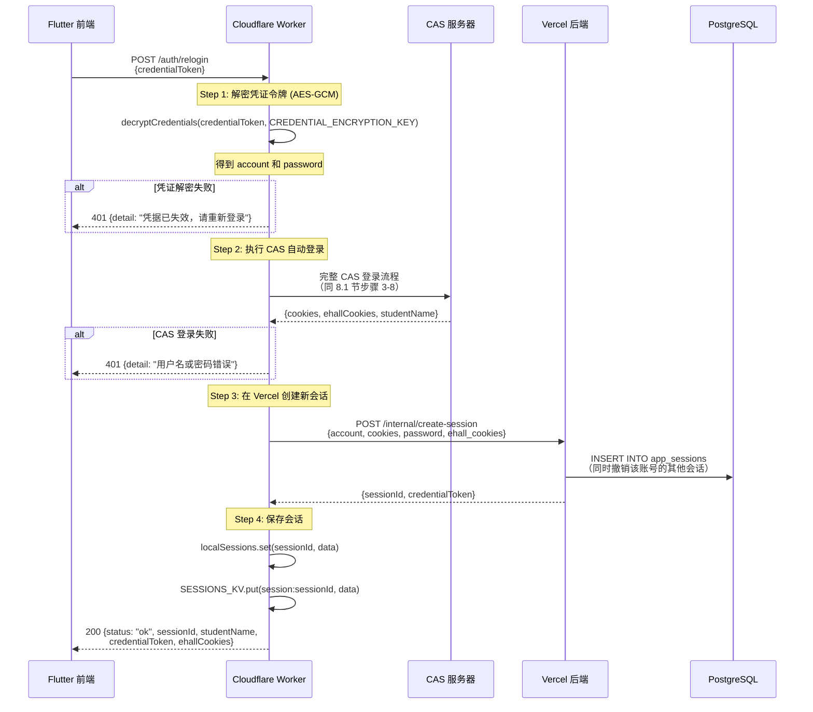
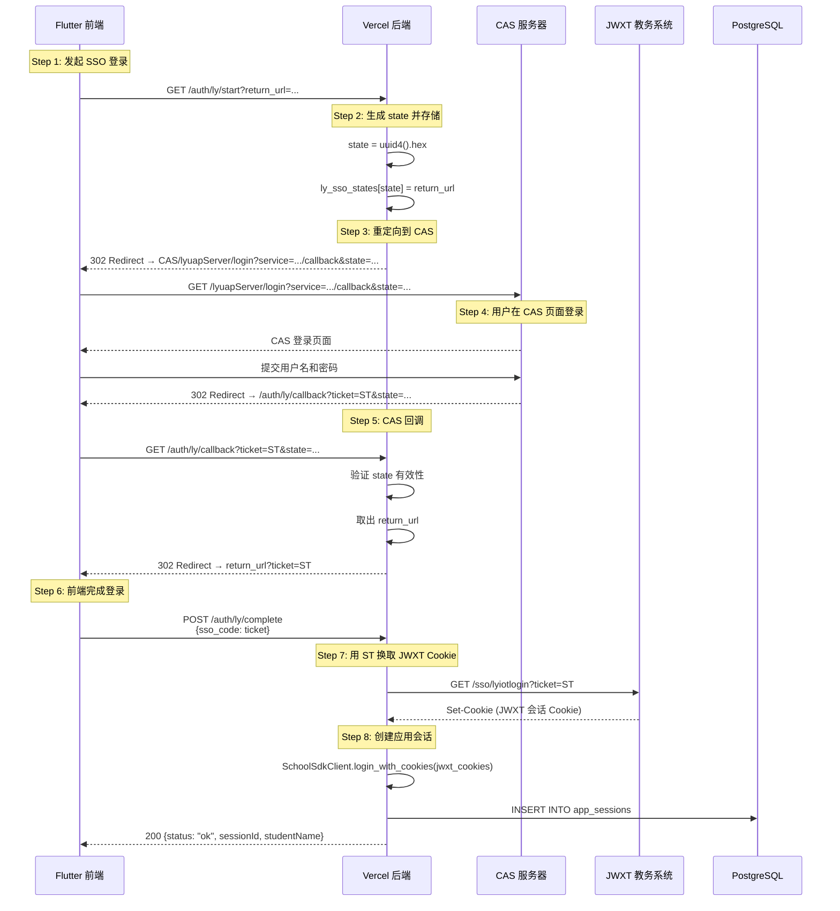
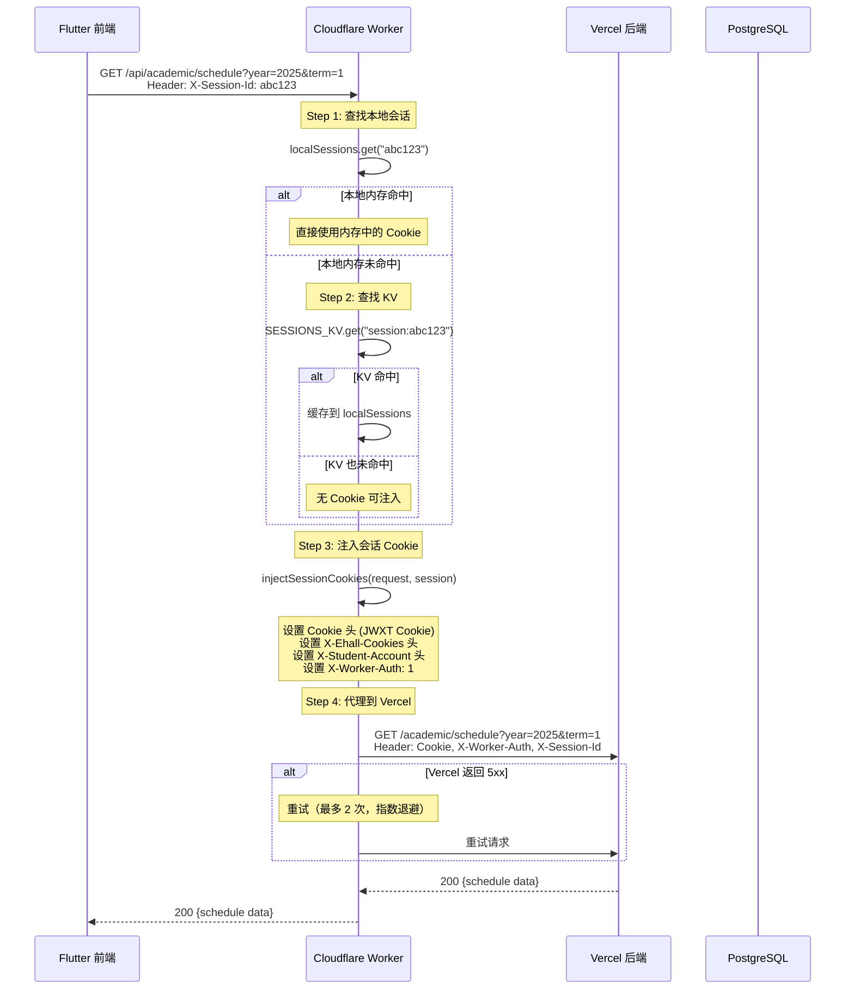
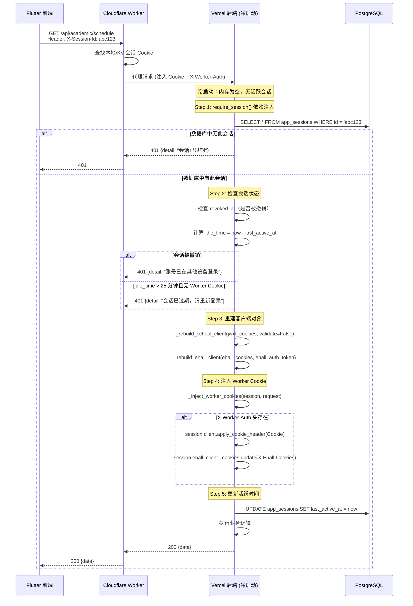
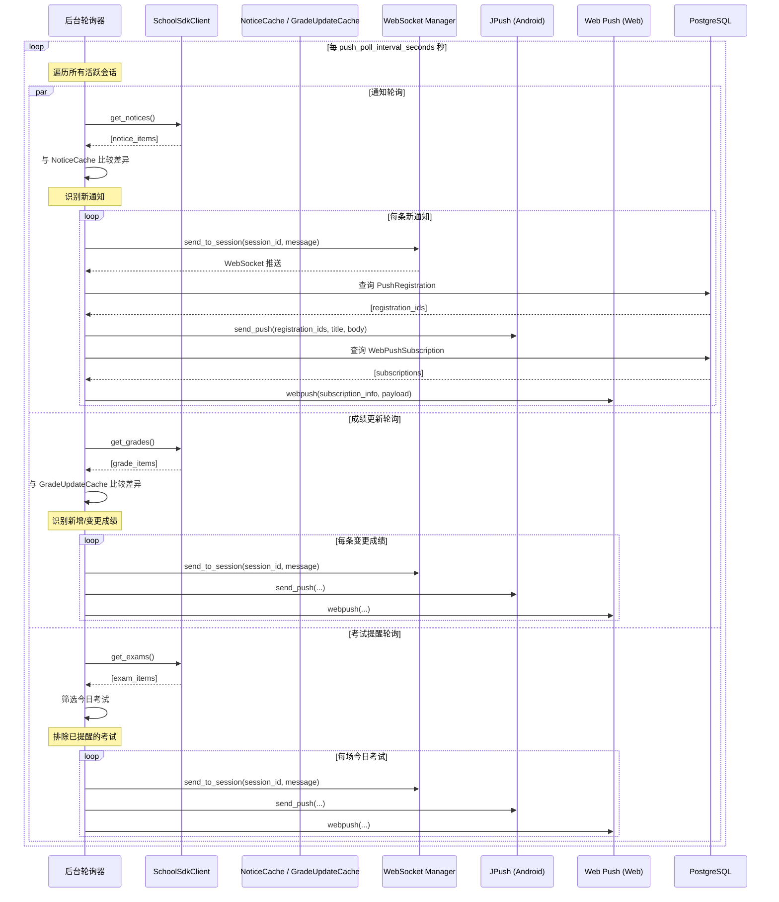
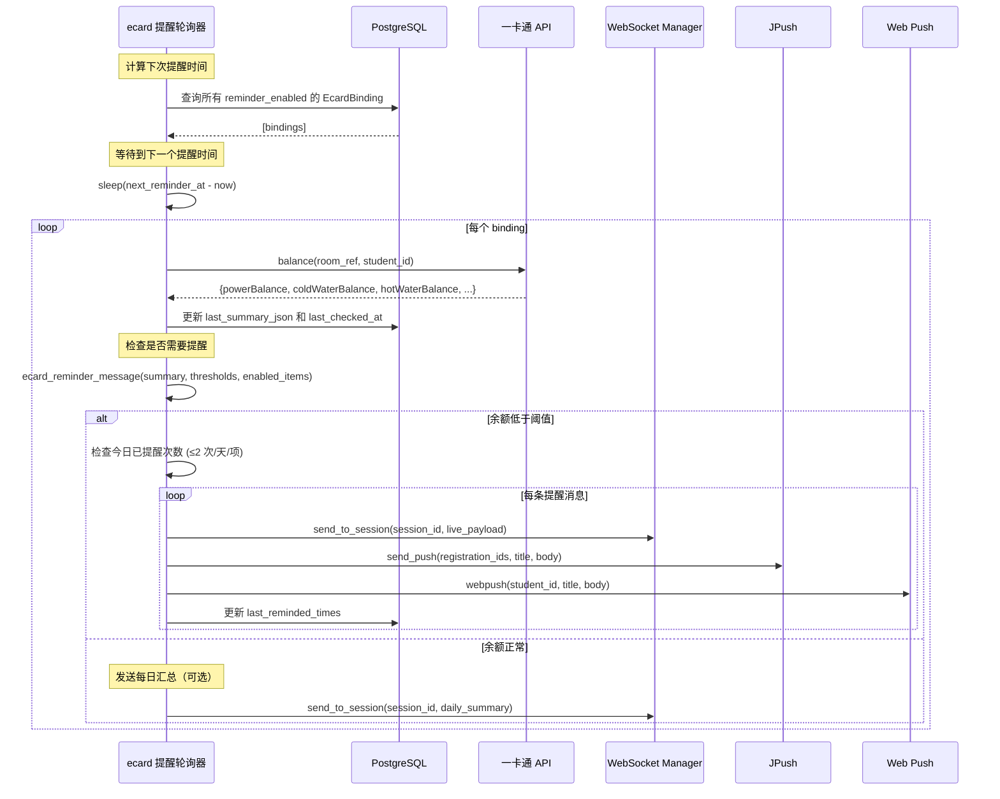
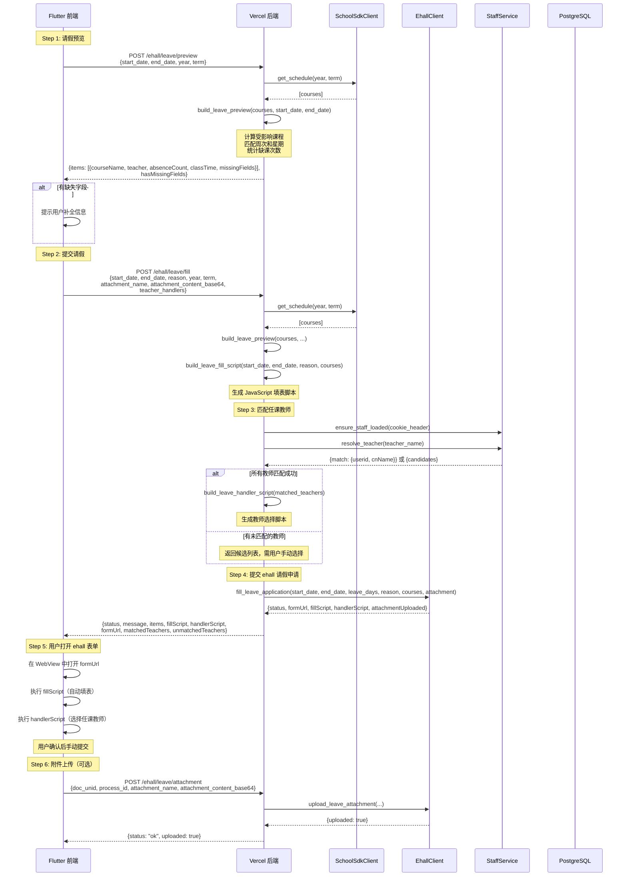
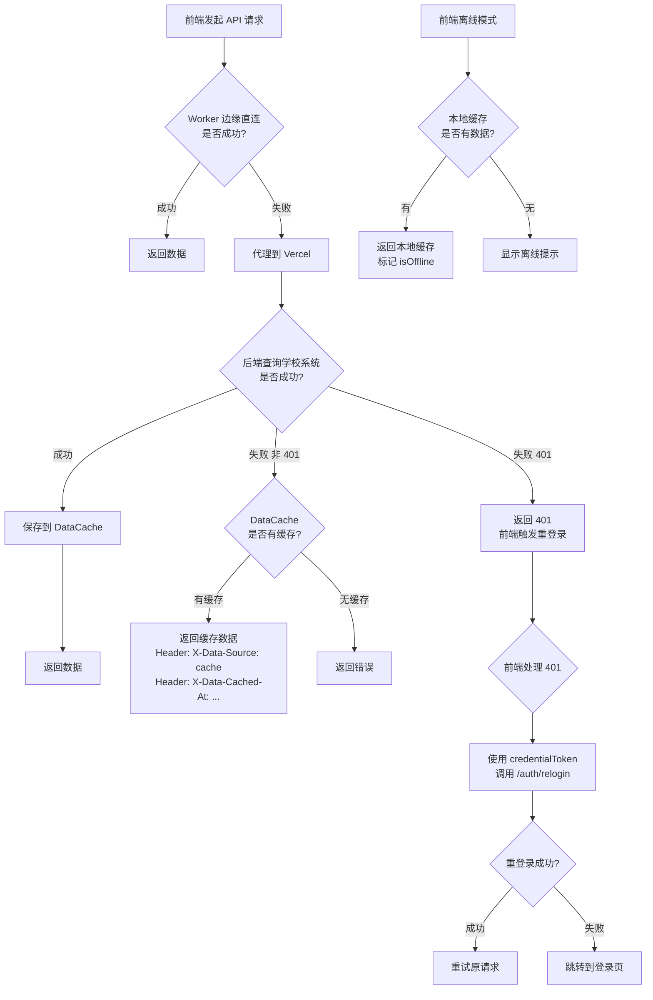
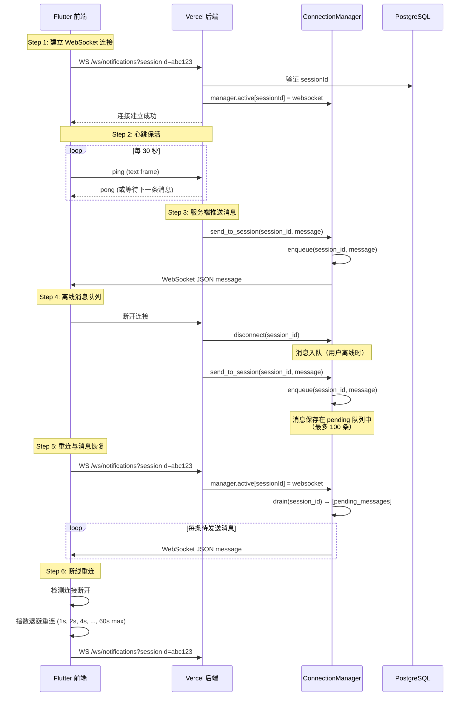

# 第8章 关键流程与时序设计

## 概述

软帮手（OneGZUS）系统的核心架构是**边缘-服务端协作模式**：Cloudflare Worker 在边缘节点处理 CAS SSO 登录（靠近中国大陆，低延迟），Vercel 后端负责业务逻辑和数据持久化。这种架构决定了系统的关键流程设计，尤其是会话管理、请求代理和冷启动恢复等机制。

本章详细描述系统中最核心的 10 个流程，每个流程包含 Mermaid 时序图和步骤说明。

---

## 8.1 CAS SSO 自动登录流程

这是系统最核心的流程。用户输入学号和密码后，前端将加密密码发送至 Worker，Worker 在边缘节点完成完整的 CAS 登录流程，包括验证码 OCR 识别、RSA 加密、表单提交和重试。

### 8.1.1 时序图

```mermaid
sequenceDiagram
    participant F as Flutter 前端
    participant W as Cloudflare Worker
    participant CAS as CAS 服务器
    participant V as Vercel 后端
    participant DB as PostgreSQL

    F->>W: POST /auth/auto-login<br/>{account, encryptedPassword, keyId}
    
    Note over W: 如果密码是 RSA 加密的，<br/>调用 Vercel 解密
    W->>V: POST /internal/decrypt-password<br/>{encrypted_password, keyId}
    V->>V: rsa_key_manager.decrypt()
    V-->>W: {password}

    Note over W: Step 1: 获取 CAS 登录页<br/>（建立会话 Cookie）
    W->>CAS: GET /lyuapServer/login?service=...
    CAS-->>W: 200 OK (登录页 HTML + Set-Cookie)

    loop 验证码重试 (最多 15 次)
        Note over W: Step 2: 下载验证码
        W->>CAS: GET /lyuapServer/kaptcha?_t=...&uid=
        CAS-->>W: {uid, content: "data:image/png;base64,..."}

        Note over W: Step 3: OCR 识别验证码
        W->>V: POST /internal/ocr<br/>{image: base64}
        V->>V: captcha_ocr.recognize()
        V-->>W: {text: "3+5"}
        W->>W: solveArithmeticCaptcha("3+5") → "8"

        alt 验证码无法解析
            Note over W: 跳过本次，重新下载验证码
        end

        Note over W: Step 4: RSA 加密密码
        W->>W: rsaEncrypt(password) → encryptedPassword
        W->>W: rsaEncrypt("lyasp" + timestamp) → token

        Note over W: Step 5: 提交 CAS 登录
        W->>CAS: POST /lyuapServer/v1/tickets<br/>{username, password, service, id, code}
        CAS-->>W: 200 {ticket, tgt} 或 {data: {code: "CODEFALSE"}}

        alt 验证码错误 (CODEFALSE)
            Note over W: 重试，获取新验证码
        else 用户名或密码错误 (FALSE)
            W-->>F: 401 {detail: "用户名或密码错误"}
        else 账号锁定 (USERLOCK)
            W-->>F: 401 {detail: "账号锁定: ..."}
        else 登录成功
            Note over W: 获得 Service Ticket (ST) 和 TGT
        end
    end

    Note over W: Step 6: 并行获取 JWXT Cookie 和 ehall 会话
    par 获取 JWXT Cookie
        W->>CAS: GET JWXT_SERVICE_URL?ticket=ST
        CAS-->>W: 302 Redirect → JWXT Set-Cookie
    and 获取 ehall 会话
        W->>CAS: POST /lyuapServer/v1/tickets/{TGT}<br/>{service: ehall/shiro-cas}
        CAS-->>W: 200 (ehall ST)
        W->>CAS: GET ehall/shiro-cas?ticket=ehallST
        CAS-->>W: Set-Cookie: sid=...
    end

    Note over W: Step 7: 获取学生姓名
    W->>CAS: GET JWXT/xsgrxxIndex.html
    CAS-->>W: HTML (含学生姓名)

    Note over W: Step 8: 加密凭证 (AES-GCM)
    W->>W: encryptCredentials(account, password, key)

    Note over W: Step 9: 在 Vercel 创建会话
    W->>V: POST /internal/create-session<br/>{account, cookies, password, ehall_cookies, student_name}
    V->>V: SchoolSdkClient.login_with_cookies(validate=False)
    V->>V: encrypt_credentials() → Fernet token
    V->>DB: INSERT INTO app_sessions
    V-->>W: {sessionId, credentialToken}

    Note over W: Step 10: 保存会话到本地和 KV
    W->>W: localSessions.set(sessionId, {cookies, ehallCookies, ...})
    W->>W: SESSIONS_KV.put(session:sessionId, data)

    W-->>F: 200 {status: "ok", sessionId, studentName,<br/>credentialToken, ehallCookies}
```

### 8.1.2 步骤详解

#### 步骤 1：前端发起登录请求

前端调用 `POST /auth/auto-login`，请求体包含：
- `account`：学号
- `encryptedPassword`：RSA 加密的密码（使用后端公钥加密）
- `keyId`：RSA 公钥标识

前端在登录前先调用 `GET /auth/public-key` 获取后端 RSA 公钥，用公钥加密密码后传输，确保密码在传输过程中不被窃取。

#### 步骤 2：Worker 拦截请求并解密密码

Worker 在边缘节点拦截 `/auth/auto-login` 请求。如果密码是 RSA 加密的（`encryptedPassword` + `keyId`），Worker 调用 `POST /internal/decrypt-password` 将密码解密。这是必要的，因为 Worker 无法访问后端的 RSA 私钥。

**关键设计**：密码解密走 Vercel 后端的快速端点（< 1s），而完整的 CAS 登录流程在 Worker 边缘完成（靠近中国，低延迟）。

#### 步骤 3：获取 CAS 登录页

Worker 向 CAS 服务器发送 `GET /lyuapServer/login?service=...`，建立 CAS 会话 Cookie。此步骤有 3 次重试机制，应对 DNS 解析或连接超时等瞬态错误。

#### 步骤 4：下载验证码

Worker 向 CAS 服务器请求验证码图片 `GET /lyuapServer/kaptcha`，返回 JSON 格式 `{uid, content}`，其中 `content` 是 Base64 编码的图片。

#### 步骤 5：OCR 识别验证码

Worker 调用 `POST /internal/ocr` 将验证码图片发送至 Vercel 后端进行 OCR 识别。后端使用 `ddddocr` 库识别验证码文字。识别结果返回后，Worker 使用 `solveArithmeticCaptcha()` 函数解析算术表达式并计算结果。

**OCR 字符修正**：系统维护了一个常见的 OCR 误识别修正表（如 `o→0`、`l→1`、`S→5`），在原始识别结果无法解析时尝试修正后重新解析。

#### 步骤 6：RSA 加密并提交登录

Worker 使用 CAS 前端的 RSA 公钥加密密码，然后向 CAS 服务器提交登录表单 `POST /lyuapServer/v1/tickets`。加密算法是 BigInt.js 风格的零填充 RSA（非标准 PKCS#1），与 CAS 前端 JS 保持一致。

#### 步骤 7：验证码重试

如果 CAS 返回 `CODEFALSE`（验证码错误），Worker 会重新下载验证码并重试，最多 15 次。这是必要的，因为 ddddocr 的识别准确率不是 100%。

#### 步骤 8：获取 JWXT 和 ehall 会话

CAS 登录成功后，Worker 并行执行两个任务：
1. **JWXT 会话**：使用 Service Ticket 访问 JWXT 的 SSO 入口，获取 JWXT Cookie
2. **ehall 会话**：使用 TGT 向 CAS 请求 ehall 的 Service Ticket，然后访问 ehall 的 shiro-cas 端点获取 ehall Cookie

如果 JWXT Cookie 获取失败，Worker 会使用 TGT 请求新的 Service Ticket 作为降级方案。

#### 步骤 9：创建应用会话

Worker 调用 `POST /internal/create-session` 在 Vercel 后端创建会话。后端使用 `login_with_cookies(validate=False)` 创建 SchoolSdkClient（跳过验证，因为 Cookie 是 IP 绑定的），然后将所有会话信息持久化到 PostgreSQL。

**双重凭证加密**：
- Worker 使用 AES-GCM 加密凭证令牌（`credentialToken`）返回给前端
- Vercel 后端使用 Fernet 加密凭证存储到数据库（用于服务端自动重登录）

#### 步骤 10：保存会话到 Worker 本地和 KV

Worker 将会话数据（JWXT Cookie、ehall Cookie 等）保存到：
1. **内存**（`localSessions` Map）：同实例快速访问
2. **Cloudflare KV**（`SESSIONS_KV`）：跨实例持久化，TTL 2 小时

### 8.1.3 错误处理

| 错误码 | 含义 | 处理方式 |
|--------|------|----------|
| `CODEFALSE` | 验证码错误 | 自动重试（最多 15 次） |
| `FALSE` | 用户名或密码错误 | 返回 401，前端提示用户 |
| `PASSERROR` | 密码错误（含锁定信息） | 返回 401，显示锁定详情 |
| `NOUSER` | 账号不存在 | 返回 401 |
| `USERDISABLED` | 账号被停用 | 返回 401 |
| `USERLOCK` | 账号被锁定 | 返回 401，显示锁定信息 |
| `ISPHONEOREMAILORANSWER` | 需要二次验证 | 返回 401，提示暂不支持 |
| `ISMODIFYPASS` | 需要修改密码 | 返回 401，提示暂不支持 |
| 15 次验证码重试耗尽 | 验证码识别失败 | 返回 401，提示用户重试 |
| Vercel 会话创建失败 | 后端不可用 | 重试 1 次（2s 延迟），仍失败返回 503 |

---

## 8.2 凭证重登录流程

当用户会话过期时，前端使用之前保存的 `credentialToken` 发起重登录，无需用户重新输入密码。此流程在 Worker 边缘完成，速度快。

### 8.2.1 时序图



### 8.2.2 步骤详解

#### 步骤 1：解密凭证令牌

Worker 使用 `CREDENTIAL_ENCRYPTION_KEY` 环境变量和 AES-GCM 算法解密 `credentialToken`，得到明文的 `account` 和 `password`。

**关键设计**：Worker 使用 Web Crypto API 的 AES-GCM 加解密，而 Vercel 后端使用 Python 的 Fernet 加解密。两者使用相同的密钥材料（`CREDENTIAL_ENCRYPTION_KEY`），但算法不同。Worker 给前端的 `credentialToken` 是 AES-GCM 格式，Vercel 无法直接解密，因此 Vercel 会生成自己的 Fernet 凭证令牌存储在数据库中。

#### 步骤 2：执行 CAS 自动登录

使用解密后的账号密码，执行与 8.1 节相同的 CAS 登录流程。

#### 步骤 3：创建新会话

在 Vercel 后端创建新会话时，系统会自动撤销同一账号的其他活跃会话（单设备登录策略）。这是通过在 `sessions.create()` 中查询并更新 `revoked_at` 字段实现的。

#### 步骤 4：保存会话

与自动登录流程相同，保存到 Worker 内存和 Cloudflare KV。

---

## 8.3 SSO 浏览器登录流程

用户也可以通过浏览器 CAS SSO 方式登录，无需在应用内输入密码。此流程通过 CAS 重定向实现。

### 8.3.1 时序图



### 8.3.2 步骤详解

#### 步骤 1-3：发起 SSO 登录

前端调用 `GET /auth/ly/start`，后端生成随机 `state` 参数防止 CSRF 攻击，然后将用户重定向到 CAS 登录页面。回调 URL 中包含 `state` 参数。

#### 步骤 4：用户在 CAS 页面登录

用户在 CAS 页面输入用户名和密码完成认证。CAS 认证成功后，重定向回应用的回调 URL，携带 Service Ticket。

#### 步骤 5-6：CAS 回调

后端验证 `state` 参数的有效性，然后将 Service Ticket 传回前端。前端调用 `POST /auth/ly/complete` 完成登录。

#### 步骤 7-8：换取 JWXT Cookie 并创建会话

后端使用 Service Ticket 访问 JWXT 的 SSO 入口，获取 JWXT 会话 Cookie，然后创建应用会话。

**注意**：SSO 浏览器登录流程不经过 Worker 边缘，因此 JWXT Cookie 绑定的是 Vercel 的 IP，而非 Worker 的边缘 IP。这可能导致后续请求代理时需要特殊处理。

---

## 8.4 请求代理流程

前端的所有 API 请求（除了登录和健康检查）都经过 Cloudflare Worker 代理到 Vercel 后端。Worker 在代理过程中注入会话 Cookie，确保后端能够访问学校系统。

### 8.4.1 时序图



### 8.4.2 步骤详解

#### 步骤 1-2：查找会话 Cookie

Worker 首先在内存 `localSessions` Map 中查找会话数据。如果未命中，则查询 Cloudflare KV。KV 查找成功后，会将数据缓存到内存中，后续请求无需再查 KV。

**两级缓存设计**：
- **内存**（`localSessions`）：同 Worker 实例快速访问，O(1) 复杂度
- **KV**（`SESSIONS_KV`）：跨实例持久化，应对 Worker 冷启动或不同 PoP 节点

#### 步骤 3：注入会话 Cookie

Worker 在请求头中注入以下信息：
- `Cookie`：JWXT 会话 Cookie（IP 绑定到 Worker 边缘）
- `X-Ehall-Cookies`：ehall 会话 Cookie
- `X-Student-Account`：学号
- `X-Worker-Auth: 1`：标记 Cookie 来自 Worker 边缘

`X-Worker-Auth` 头是关键：它告诉 Vercel 后端这些 Cookie 是 IP 绑定的（绑定到 Worker 的边缘 IP），后端不应尝试验证这些 Cookie（因为 Vercel 的 IP 不同，验证会失败）。

#### 步骤 4：代理到 Vercel

Worker 将修改后的请求转发到 Vercel 后端。如果 Vercel 返回 5xx 错误，Worker 会自动重试（最多 2 次，指数退避：200ms、400ms）。

**降级策略**：如果所有重试失败且 Worker 没有本地会话 Cookie（`hadLocalSession=false`），Worker 返回 401 而非 502，触发前端重登录流程。这是因为没有 Worker Cookie 的情况下，Vercel 使用数据库中可能过期的 Cookie，失败几乎必然是因为会话过期。

#### 边缘直连优化

对于部分高频学术 API（`/exams`、`/schedule`、`/grades`、`/credits`、`/attendance`、`/notices`、`/me`），Worker 会尝试直接使用本地 Cookie 访问 JWXT 服务器，避免 Vercel 的 10 秒超时限制。如果边缘直连失败，则降级到 Vercel 代理。

---

## 8.5 会话恢复流程（冷启动）

Vercel 是 Serverless 架构，函数冷启动时内存状态全部丢失。系统通过数据库持久化和 Worker Cookie 注入实现会话恢复。

### 8.5.1 时序图



### 8.5.2 步骤详解

#### 步骤 1：从数据库加载会话

`require_session()` 依赖注入函数从 `X-Session-Id` 请求头获取会话 ID，然后从 PostgreSQL 的 `app_sessions` 表加载会话数据。

**Neon 冷启动延迟处理**：Neon PostgreSQL 在自动挂起后需要唤醒，可能导致读延迟。系统实现了 3 次重试机制（延迟 0.3s、0.6s、0.9s），应对读后写延迟（read-after-write lag）。

#### 步骤 2：检查会话状态

- **撤销检查**：如果 `revoked_at` 不为空，说明该账号已在其他设备登录，返回 401
- **空闲超时检查**：如果会话空闲超过 25 分钟（`SESSION_IDLE_STALE_THRESHOLD`）且 Worker 没有注入 Cookie，返回 401 触发前端重登录

**25 分钟阈值的依据**：JWXT 会话通常在 30 分钟不活跃后过期。系统提前 5 分钟返回 401，让前端在用户感知到慢速失败之前触发重登录。

#### 步骤 3：重建客户端对象

从数据库中存储的 Cookie 字符串重建 `SchoolSdkClient` 和 `EhallClient`。重建时使用 `validate=False`，因为数据库中的 Cookie 可能已经过期（IP 绑定问题）。

**容错设计**：如果客户端重建失败，`session.client` 设为 `None`，但不返回错误。后续 `_inject_worker_cookies()` 可能通过 Worker 注入的新 Cookie 恢复客户端。

#### 步骤 4：注入 Worker Cookie

这是会话恢复的关键步骤。Worker 在每个代理请求中注入的 Cookie 和 `X-Worker-Auth` 头，让后端能够用新鲜的、IP 正确的 Cookie 覆盖数据库中可能过期的 Cookie。

**恢复机制**：如果 `session.client` 为 `None`（数据库 Cookie 过期导致重建失败），但 Worker 注入了新 Cookie，后端会创建新的 `SchoolSdkClient` 并用 Worker Cookie 初始化。

#### 步骤 5：更新活跃时间

每次成功处理请求后，更新 `last_active_at` 字段，实现滑动 TTL。

---

## 8.6 通知推送流程

系统通过后台轮询器定期检查教务系统的通知、成绩和考试变化，检测到变化后通过多种渠道推送。

### 8.6.1 时序图



### 8.6.2 步骤详解

#### 通知轮询

1. 调用 `client.get_notices()` 获取 JWXT 通知，如果 `ehall_client` 可用则合并 ehall 通知
2. 与 `NoticeCache` 中缓存的通知标题集合比较，识别新增通知
3. 首次轮询不推送（仅建立基线）
4. 最多推送 5 条新通知

#### 成绩更新轮询

1. 调用 `client.get_grades()` 获取成绩列表
2. 使用 `grade_snapshot()` 生成当前成绩签名（课程名+学期 → 分数+绩点）
3. 与 `GradeUpdateCache` 中缓存的成绩签名比较
4. 识别新增课程或分数变更的课程（最多推送 3 条）

#### 考试提醒轮询

1. 调用 `client.get_exams()` 获取考试列表
2. 筛选今日考试（比较考试日期与当前日期）
3. 使用 `ExamReminderCache` 去重，避免重复提醒
4. 推送包含进度信息的 Live Activity 消息

#### 多渠道推送

- **WebSocket**：实时推送给在线用户
- **JPush**：推送给 Android 设备（通过 `registration_id`）
- **Web Push**：推送给 Web 用户（通过 VAPID 协议）

---

## 8.7 水电费提醒流程

用户绑定宿舍后，系统定期查询水电费余额，在余额低于阈值时发送提醒。

### 8.7.1 时序图



### 8.7.2 步骤详解

#### 提醒时间计算

系统根据用户配置的 `reminder_times`（如 `["08:00", "20:00"]`）计算下次提醒时间。如果用户未配置，使用默认时间（`ecard_daily_reminder_hour:ecard_daily_reminder_minute`）。

#### 余额查询

使用 `EcardClient.balance()` 查询宿舍的水电费余额。查询结果包含：
- `powerBalance` / `powerText`：电费余额
- `coldWaterBalance` / `coldWaterText`：冷水余额
- `hotWaterBalance` / `hotWaterText`：热水余额

#### 提醒策略

- **阈值提醒**：余额低于用户配置的阈值时发送提醒
  - 电费极低（< 10 元）：紧急提醒
  - 电费偏低（< 阈值）：普通提醒
  - 冷水/热水偏低：普通提醒
- **每日汇总**：如果所有余额都在阈值以上，发送当日余额汇总
- **频率限制**：每项每天最多提醒 2 次，避免过度打扰

#### Live Activity 支持

水电费提醒推送包含进度信息（`progressMax`、`progressCurrent`、`progress`），支持 Android 的 Live Activity 展示。

---

## 8.8 请假流程

请假是系统的特色功能之一，通过自动化脚本帮助用户快速填写 ehall 请假表单。

### 8.8.1 时序图



### 8.8.2 步骤详解

#### 步骤 1：请假预览

前端提交请假日期范围，后端根据课表计算受影响的课程：
1. 获取当前学期的课表
2. 遍历日期范围内的每一天，计算周次和星期
3. 对每门课判断是否在该天有课（`week_spec_contains` 函数处理"1-16周"、"单周"等复杂周次表达）
4. 按课程分组，统计缺课次数和上课时间

**缺失字段检测**：部分课程可能缺少课程代码、班级编号、课程性质、学分等必填字段。系统标记这些字段，提示用户补全。

#### 步骤 2：生成填表脚本

`build_leave_fill_script()` 生成一段 JavaScript 代码，在 ehall 表单页面执行时自动：
1. 设置开始时间、结束时间、请假天数、请假理由
2. 动态生成课程明细表格行
3. 触发 EasyUI 组件的渲染（`$.parser.parse`）
4. 自动选择"任课教师"审批节点

#### 步骤 3：匹配任课教师

使用 `StaffService` 将课表中的教师姓名匹配到 ehall 系统中的教职工 userid：
1. 首次使用时从 ehall 加载教职工列表到数据库
2. 使用 `resolve_teacher()` 进行模糊匹配
3. 匹配成功则自动选择，失败则返回候选列表

#### 步骤 4：提交 ehall 请假申请

调用 `EhallClient.fill_leave_application()` 在 ehall 系统中创建请假申请，并上传附件。

#### 步骤 5-6：用户确认并提交

前端在 WebView 中打开 ehall 表单页面，执行自动填表脚本和教师选择脚本。用户确认信息无误后手动提交。如果需要，还可以单独上传附件。

---

## 8.9 数据缓存与降级流程

系统实现了多级缓存和降级策略，确保在学校系统不可用时仍能提供基本服务。

### 8.9.1 流程图



### 8.9.2 缓存层级

| 层级 | 位置 | 存储 | TTL | 用途 |
|------|------|------|-----|------|
| L1 | Worker 内存 | `localSessions` | 会话生命周期 | Cookie 快速访问 |
| L2 | Cloudflare KV | `SESSIONS_KV` | 2 小时 | 跨实例 Cookie 持久化 |
| L3 | Vercel 后端 | `DataCache` 表 | 永久（直到被覆盖） | 学术数据缓存 |
| L4 | 前端本地 | SharedPreferences / IndexedDB | 永久 | 离线数据访问 |

### 8.9.3 降级策略详解

#### 正常流程

前端请求 → Worker 边缘直连 JWXT → 返回数据。边缘直连避免了 Vercel 的 10 秒超时限制，响应更快。

#### Worker 边缘失败 → Vercel 代理

如果 Worker 边缘直连失败（JWXT 返回非 200、Cookie 过期等），降级到 Vercel 代理。Vercel 后端使用 `SchoolSdkClient` 访问 JWXT。

#### 学校系统不可用 → DataCache 降级

Vercel 后端在 `_run_with_cache_fallback()` 中实现缓存降级：
1. 正常查询学校系统，成功后将结果保存到 `DataCache` 表
2. 如果查询失败（非 401 错误），从 `DataCache` 加载缓存数据
3. 缓存响应包含 `X-Data-Source: cache` 和 `X-Data-Cached-At` 头，让前端知道数据来源

**DataCache 键设计**：`{student_id}:{resource}:{params_hash}`，其中 `params_hash` 是查询参数的 SHA-256 前 16 位，确保不同查询参数的缓存互不干扰。

#### 会话过期 → 重登录

如果后端返回 401，前端自动使用 `credentialToken` 调用 `POST /auth/relogin`。重登录成功后自动重试原请求。如果重登录也失败（凭证过期），跳转到登录页。

#### 离线模式

前端在本地缓存最近一次成功获取的数据。当网络不可用时，从本地缓存返回数据并标记 `isOffline`。

---

## 8.10 WebSocket 实时通信流程

系统通过 WebSocket 实现实时通知推送，支持在线用户的即时消息送达。

### 8.10.1 时序图



### 8.10.2 步骤详解

#### 步骤 1：建立连接

前端使用 `WsService.connect()` 建立 WebSocket 连接。URL 格式为 `wss://{host}/ws/notifications?sessionId={sessionId}`。后端在 `websocket_notifications()` 端点中验证 sessionId，验证通过后将 WebSocket 连接注册到 `ConnectionManager`。

#### 步骤 2：心跳保活

前端通过持续接收消息来检测连接活性。后端 WebSocket 端点在 `while True` 循环中等待客户端消息，如果客户端断开连接则触发 `WebSocketDisconnect` 异常。

#### 步骤 3：服务端推送消息

后台轮询器检测到新通知、成绩更新或水电费提醒时，调用 `ConnectionManager.send_to_session()` 推送消息。消息格式为 JSON，包含 `type`、`title`、`body`、`extras` 等字段。

**消息增强**：`send_to_session()` 在推送前会为消息添加 `id`（UUID）和 `extras` 字段，包含消息类型、URL、课程名等元数据。

#### 步骤 4：离线消息队列

当用户 WebSocket 连接断开时，`ConnectionManager` 将消息入队到 `pending` 字典中。每个会话的待发送消息最多保留 100 条（超出部分丢弃旧消息）。

#### 步骤 5：重连与消息恢复

用户重新连接后，`ConnectionManager` 调用 `drain()` 方法将所有待发送消息一次性发送给客户端。这确保了用户在短暂断线期间不会丢失重要通知。

#### 步骤 6：断线重连策略

前端实现了指数退避重连策略：
- 初始延迟：1 秒
- 每次失败后延迟翻倍：2s → 4s → 8s → ...
- 最大延迟：60 秒
- 应用暂停（`pause()`）时不重连
- 应用恢复（`resume()`）时立即重连

**暂停/恢复机制**：当应用进入后台时，`WsService.pause()` 关闭 WebSocket 连接并取消重连定时器。当应用回到前台时，`WsService.resume()` 立即重新建立连接。这避免了应用在后台时浪费网络资源。

---

## 附录：关键配置参数

| 参数 | 默认值 | 说明 |
|------|--------|------|
| `MAX_CAPTCHA_RETRIES` | 15 | CAS 验证码最大重试次数 |
| `SESSION_IDLE_STALE_THRESHOLD` | 25 分钟 | 会话空闲超时阈值 |
| `SESSION_KV_TTL` | 7200 秒 | Cloudflare KV 会话 TTL |
| `SESSION_PENDING_QUEUE_MAX` | 100 | WebSocket 离线消息队列上限 |
| `WS_RECONNECT_DELAY_MAX` | 60 秒 | WebSocket 重连最大延迟 |
| `ECARD_DAILY_REMINDER_MAX` | 2 次/项/天 | 水电费每日提醒上限 |
| `PROXY_MAX_RETRIES` | 2 | Vercel 代理最大重试次数 |
| `DB_CONNECTION_RETRIES` | 3 | 数据库连接最大重试次数 |